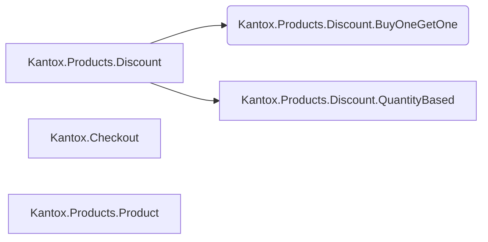
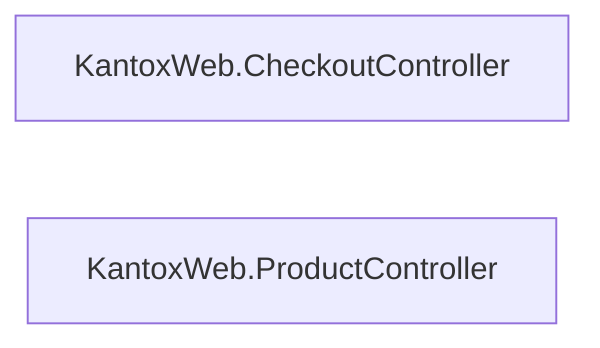

# Kantox

## Installation & Start

To start the application:

  * Run `mix setup` to install and setup dependencies
  * Start Phoenix endpoint with `mix phx.server` or inside IEx with `iex -S mix phx.server`

Now you can visit [`localhost:4000`](http://localhost:4000) from your browser.

To play with endpoints check Swagger UI: [`localhost:4000/swaggerui`](http://localhost:4000/swaggerui)

## Overview

This is a fully functional Phoenix application implementing a REST API for a product list and shopping cart. It utilizes several libraries: `Ecto` for database operations (`SQLite`), `Decimal` for handling prices, `OpenApiSpex` for comprehensive documentation and `Swagger UI`, and `Scrivener.Ecto` for pagination, `Telemetry` for metrics.

It includes CI workflows for `Compiling (warnings-as-errors)`, `Check format`, `Dialyzer`, `Credo`, `Tests`, `Hex Audit`.

Test coverage is `90.00%`, it includes unit and integration tests for API endpoints.

The main system architecture is as follows:



The web architecture consists of two controllers:



The discount architecture is now more flexible. We currently support only two strategies: `BuyOneGetOne` and `QuantityBased`. The `QuantityBased` strategy includes parameters that allow for flexible configuration.

The parameters are structured as follows:

```elixir
# 10% discount for quantities over 100
%QuantityBased{
  compare_in: [:gt],
  count: Decimal.new("100"),
  mode: :discount,
  value: Decimal.new("0.9")
}

# set fixed price (4.50) for each product and quantities over or equal 3
%QuantityBased{
  compare_in: [:gt, :lt],
  count: Decimal.new(3),
  mode: :fixed_price,
  value: Decimal.new("4.50")
}
```

For the test task, discount rules are stored in a configuration file; however, in a real-world scenario, they should be stored in a database.
