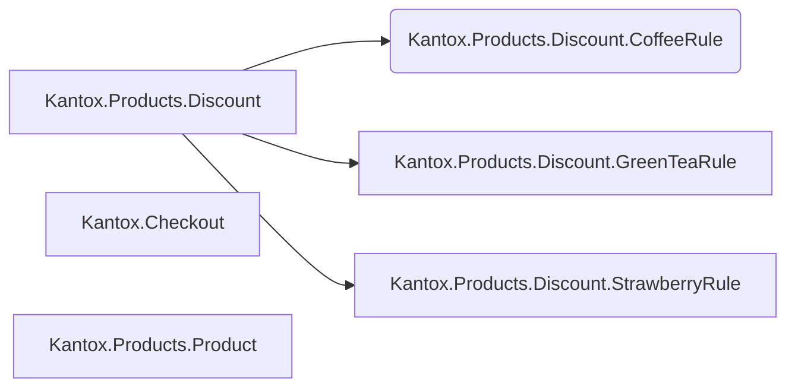

# Kantox

## Overview

This is an Elixir-based shopping cart system that implements basic product management and discount strategies.
The system consists of three main components:

### Core Modules



- `Kantox.Products.Discount`: A behavior module defining discount strategies
  - Provides `apply/2` function that takes price and amount, returns total price with discount
  - Can be extended with different discount implementations

- `Kantox.Products.Product`: A struct for product information
  - Stores basic product details

- `Kantox.Checkout`: The main shopping cart logic
  - Handles cart operations
  - Calculates final prices
  - Applies discounts using the `Kantox.Products.Discount` strategy

## Current Implementation

The current version focuses on simplicity and core functionality, avoiding over-engineering while maintaining extensibility.

### Features
- Basic product management
- Simple discount strategies
- Single-currency support
- Individual item discount processing

## Future Improvements

### Multi-Currency Support
The current implementation uses simple price values without currency designation. To add multi-currency support, we could:

1. Create a dedicated Price struct:

```elixir
defmodule Kantox.Price do
  defstruct [:amount, :currency]
end
```

2. Or utilize existing solutions like `elixirmoney/money` library.

### Enhanced Discount Rules

The current system processes discounts individually. Potential improvements include:

1. Cart-wide discount rules:
   - Modify `Discount.apply` to accept the entire cart
   - Enable complex discount interactions
   - Support combination rules
